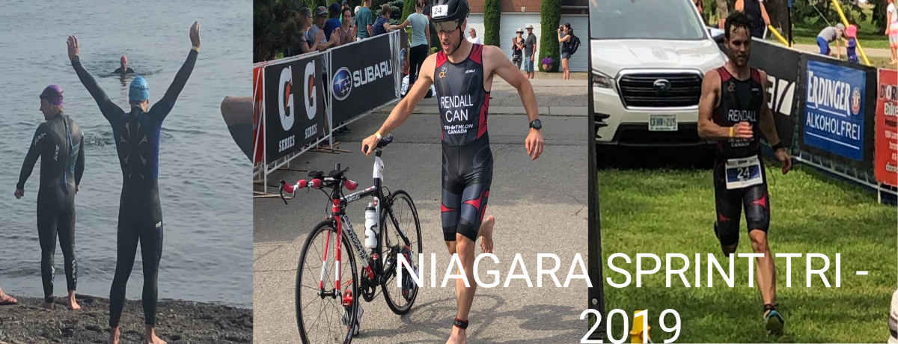

# Introduction
Thank you for tuning in to my first post of 2019! This also coincides with my first race of the year - the Niagara Sprint triathlon held by Subaru Triathlon Series.

Here we go!

# The Build Up

## Concussion
In May of this year, my front tire popped on a training ride and I flew over my handle bars. I got a pretty bad concussion and my whole right side was scraped up.

I had planned to race twice in June (in Guelph and Welland) at two qualifying races (similar to my race in [Toronto](./toronto-triathlon-festival-2018) last year. In the end, I had to cancel them because my head was not ready. I would get dizzy after any short effort.
> These would have been qualification races for Age-Group World's in 2020 (not that I could afford to go, but it would be in Edmonton with some ways to make it more affordable -- anyways, I didn't race them so it does not matter!). 

This period was super stressful because I had no idea if I would be ready to race at [Age-Group World's](https://trilausanne.ch) at the end of August, and I could not seem to build up my training load.

## Recovery
Since I had a hematoma just above my right hip (later, I determined that it was most likely from my C02 cartridge pressing into my body as I slide along the pavement), the first stages of my recovery involved addressing the swim, and my twisting flexibility. I had to gradually increase time in the water but stop if my side was unrelenting or if I had dizziness that would not go away.

For the bike, I had to bike inside to begin with so that if I was dizzy, I could stop. It took 4 weeks before I was able to my first training ride on the road. I was clutching my handle bars tight and went out with friends to be safe. I have to say I was pretty nervous getting back on the bike, and had spent another $150 on rubber for the bike.

# Race Day

## Swim - 750m
The water was the coldest I have ever swam in! Apparently, the water was measured at 65F but the water may have turned over due to the wind direction. I had a wetsuit on, and my teeth were still chattering, I couldn't feel my feet, hands or face.

I set myself up in the front row near the first buoy, nearly in line with Jessey the Elf (an accomplished and super fast triathlete in Ontario). This was the first race where I thought, 'I shouldn't -- no, I think I am fast enough to be in the front'. 

We start the race and I am in the draft triangle the whole way to the first turn. However, as we approach the turn, someone cuts over and kicks me in the face. That, along with the super cold water, sent me into hyperventilation instantly. I needed more air all of a sudden, but the turn buoy was sending waves in my direction so I breathed in water instead.

I flipped over to my back to get away from the crowd, tried to flip back over but was still hyperventilating, and so I flipped back over to backstroke one more time, heading in the direction of the race. I had to flip over to my back in Guelph and Toronto last year, but in those cases thought I was done and was ready to quit. This time, I was actually focused on getting back to speed and making up for it.

In the end, I held 1:48/100m, which suggests that minus the flip-over, I was probably holding my goal of around 1:35/100m. I really have to become more resilient to swimming panic/obstacles.

I still ended up coming out of the water in position 5 or 6 somehow, so overall - a good swim.

## T1
I had the best-feeling 1st transition of any of my races so far. I had my ear plugs, goggles and swim cap in hand by the time I was up at the transition zone, wetsuit down to my waist, and I did not make any mistakes in grabbing my helmet first before my bike. 

Before the race, I had heard I only needed the number bib for the run, so for the first time, I did not have to waste time trying to put it on for the bike. 

I had also practiced putting on my helmet with the visor attached. My head fits easily if I keep the helmet tilted up as I slide it on and into place. This process ended up being quick on race day.

## Bike - 25km
As I hopped on the bike, I felt a little unstable and once again, could not get my feet into my shoes very easily. This time it was not that the insoles scrunched up or anything like that (I opened up the velcro as wide as I could to help with getting my feet in). It was almost like a little tightness from the swim made it harder for me to reach down so I was not balanced. As a result, two people passed me while I was strapping in.

This did not bother me too much, as I was able to pass them within a few kilometres. The first half of the bike was a tail wind and the second half a head wind, which I knew would be the case. I took the opportunity to go as fast as I could with the tail wind, and was able to maintain between 40 and 47km/h out. Other than the first two riders, I did not see any others on my way out.

As I approached the turn around, I saw Jessey the Elf, and then 3 others follow, making me 5th overall. In the head wind on the way back, I was able to hold 33 to 35 km/h and pass two riders, putting me in 3rd.

Other than the road being quite cracked, and the head wind causing me to reduce my speed in order to handle the run, the bike was quite good.

## T2
Transition 2 also ended up being quite smooth compared to some of my previous races. I had opened up my running shoes to be easier to slip on, but I ended up standing in place to put my number bib on instead of what I had planned - putting it on while running to the exit.

## Run - 7km
The run was hot. Not in a good way. I went out at around 4:05/km and quickly realized I was not going to have much more in me. The first half of the run was the same head wind I just had on the bike. My plan morphed into increasing my speed on the way back with a little help from the tail wind.

The whole way out, I had someone about 200m behind me, but neither of us were increasing our running speed so the gap was stable. However, he took longer at water stations than I did so I started to increase the gap.

Then, I saw Jessey the Elf running back. He was probably 3-4km ahead of me! With about 1km to the turn around, someone in the 20-24 age group came blowing by me. I tried to increase my speed but I could barely breathe due to the heat and my legs were gassed from the head wind on the bike. I maintained to the turn around.

There was one guy up ahead that I seemed to be slowly gaining on, so I set my new goal to try to end in 3rd place overall by passing him. I spent kilometres 4-6 on this goal and increased my speed to 3:50/km. I passed him and held a good gap right to the finish line.

I do admit that the gap helped put me at ease, but I had not been thinking of older age-groups at the time. I maintained instead of increasing speed through the last kilometre, and some older athletes ended up having better times overall, bumping down my overall placing to 8th.

## Result
I placed 8th overall, 3rd in the first wave, and 1st in my age group category (25-29). It definitely was a good result and showed me that my fitness has returned to a good standard since my concussion. 

# My Other Half
This race also marked my fiancée's first triathlon - the Try-a-Tri. She did not have to swim, since the organizers cancelled it due to the temperature (and hypothermic athletes that had to be taken to hospital). However, running in the heat twice was definitely a tough trade-off. She finished it all, and is happy that she was able to achieve such a feat. She mentioned that she would definitely do another, but a 'real' triathlon next time (with a swim). I am glad I was able to help her accomplish this goal 😃.

# Looking Ahead
Remaining this year, I just have my race on August 31st in Lausanne, Switzerland. The next three weeks will be a build up followed by a peak culminating in the Age-Group World Championship race. The race will mark the start of a vacation in Germany and Portugal with my fiancée that will be super rewarding and replenishing after a long tough year. I look forward to it all and will be sure not to take any of it for granted.

Thanks for reading!
~ Jordan

<u>[Check out the rest of my posts on my blog by clicking here!](/blog)</u>
