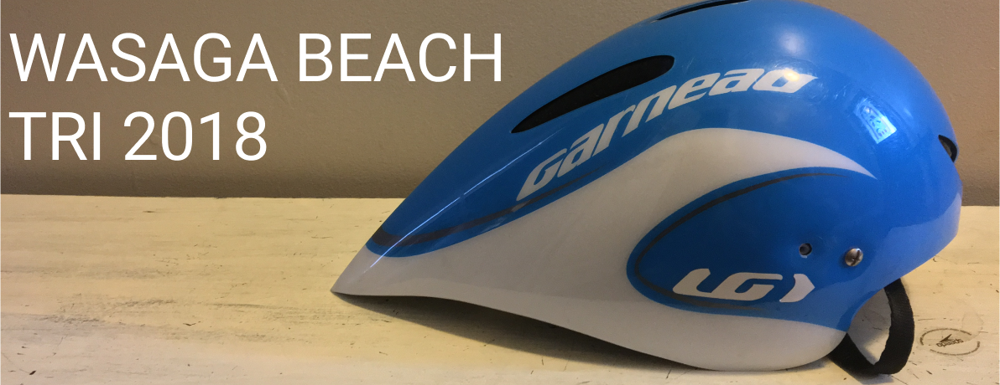

### Overall Time: 2:10:58

## Motivation

I signed up for this race in the winter months, along with the Welland sprint triathlon. I was thinking, ”Okay, I’ll do a sprint distance early in the year, and an Olympic distance later and work my way up in between — seems like a good motivator to train” (sprint distance triathlons involve a 750m swim, 20km bike, and a 5km run, whereas an Olympic or international distance triathlon is double the sprint distance). I had no idea of how the swim would go at the time, so I put myself in the second wave (which turns out was the 30-45 age group wave). I thought if I was away from the first wave, I would be staying away from the really fast swimmers and not get trampled or drown.

The other reason I signed up for this race (along with Welland) was that it was an Age-group World Triathlon Championships qualifying event — why not try, right? There was only one spot per gender, per age group. I was not banking on winning my age-group when I signed up, but by the time I was at the start line I had qualified in the sprint distance (at the Toronto Triathlon Festival) so really anything was possible.

## Pre-Race

Britney and I went to Wasaga Beach the night before and stayed with friends who lived a short walk from the race venue. We got in late, and I did not end up getting to sleep until 11PM, but the race start time was late at 10:30, so I gave myself the 7-8 hours of sleep I needed and had lots of time in the morning to get ready.

I was back on coffee and had a new fancy for those stove top espresso makers, so I made myself a coffee, and a nut-butter and banana sandwich at about 3 hours before the start of the race.

I drank a lot of water, and started to get my bike ready, adding a bit of chain lube since I had not managed to do a full wash during the week. My host dropped me off at the transition area, and I made my through the rounds of registration.

There is always (for me at this stage) a need to quickly figure out where exactly we will be running in and out of the transition zone since I have not yet raced any course twice. I placed my bike as close as possible to the bike in/out exit and pointed the bike towards the exit on the rack. My plan was to run to the opposite side of the rack when I came back in so that running would be a straight shot to the run exit.

It was now about 50 minutes until the race, so I began my warm up run (10 minutes easy with bursts) out and around the sandy town of Wasaga Beach.

When I got back, the line for the porto-potties was huge! It would make me late for my race so I had to pass on the extra bathroom break and start to put on my wet suit.

For the first time ever at a race, I was able to pull the zipper all the way up (it’s on the back side of the suit) without asking for anyone to help! Off to a good start.

After listening to a short talk from the race organizer, I made my way to the beach to start my practice swim. I swam about 200 metres then made my way back to the start line, seeing Abe on my way. We would be starting together after all since I signed up for wave 2.

## The Swim

Half-sitting, half-standing, I waited for the horn. I knew I would not be doing the butterfly, but part of me wanted to! I slipped back a row and decided I would just go to the outside of the group to get my own path. The water was just above my waist, so when the horn went off, I had to water run a little bit, avoiding some slower people in front of me, then I started to dive into the water when I had room.

The sand bars came up and down so I found myself taking a few steps in water-run mode, then diving back in to swim again. After a few rounds of this, I was in deep enough water to just swim.

I found that I was able to hold a nice pace (I was unaware of my exact speed, but it felt good), and a pretty straight line. There were slower swimmers to both my left and right going slightly off course, so I chose to cut through the middle.

Thankfully, it worked out well for me — I only had to zigzag around a couple people on my path to the first turn. I was implementing a 3 stroke - 2 stroke breathing pattern so I was able to keep an eye on potential crashes.

I could barely see the large green turn buoys off in the distance (since I was now swimming double the distance I was used to), but the race organizers had large orange buoys to guide us to the greens.

Rarely drafting, since I was in a good groove and drafting off the people I was near would be too much risk for reward — they were either not much faster than I was or were slower; I did not want to get kicked or have to course-correct too much — I finished the swim hard and ran up the beach to transition to the cheers of my fiancee and our friends.

## Transition 1: Swim to Bike

This transition went relatively smoothly. I tried a new method I saw on the Multi-sport Facebook feed: clipping on my helmet while I used my feet to push my wetsuit off my lower body. What ended up happening was that I could not think about both at the same time and stopped moving my feet. So, I just finished doing up my helmet then reached down to get my feet out of my wetsuit.

My bike shoes were held with elastics again, but this time I found better locations to attach them after looking at another bike close by before the race. I ran out on to the sandy pathway and did a minor flying mount — nothing superman-like but not a complete stop either.

## The Bike

The bike was tough but manageable. The elastics broke nicely, and I finally was able to get my feet into the shoes in a reasonable amount of time. I started building up to a good speed, sitting around 39/40kph in the cross wind.

I found myself passing people regularly, but there were a few hills where I did not have the momentum nor the 11th gear to keep my speed against a bigger competitor — so this particular athlete and I switched spots on the down hill and uphill back and forth three hills in a row. Eventually we were on flat and I got away and never saw him again.

I had chosen not to pursue installing my deep dish wheelset (rims with a thickness to them to provide more aerodynamics) because I did not have the time to practice with them and more importantly, I did not want to pop a tire and be at the side of the road unsure what to do — they are tubular tires with no tubes inside. I might have them looked at in the spring or try to trade for clinchers (with tubes).

Since I had not chosen deep dish, I was possibly less affected by the cross wind than some of my competitors — or at least, that’s what I would like to think. The air could travel nicely between my spokes and not be stopped by the thick rim of deep dish tires.

If I can train on deep dish though, I can probably gain even more speed. Regardless, I held an average of 39kph for the 40km of biking and although I felt it was tough, I was looking forward to the run.

## Transition 2: Bike to Run

I rolled to the dismount line, with the officials probably thinking I was going to go straight through. I had already taken my feet out of my shoes and placed them on top. I jumped off and luckily my pedals stayed in a relatively neutral and horizontal position, so my shoes did not hit the ground at all as I ran with the bike.

I found my bike rack, but only after running past it. I couldn’t see my shoes and I forgot that I was planning on running to the other side of the rack. I had to dip under the bike rack centre bar and get myself to the other side. The rest of the transition was pretty smooth. I could hear Britney and our friends cheering from the sideline. The only issue at this point was that I was slightly falling over again trying to put my shoes on. I got them on and started running out towards the last leg of the race.

## The Run

I started off pretty fast, holding around 3:45/km without feeling like I was going that fast. I toned it down because I knew I had 10km to go in this race and had not trained for that kind of speed over the whole distance. I sat around 4-4:10/km for the remainder of the first 5km lap, with the winner of my age-group passing me near the middle of the first lap — I had actually been ahead of him in race time by 5 whole minutes before the run started; his run was 7 minutes faster than mine! Either he was primarily a runner, I need to work on my speed over longer distances, or a bit of both.

I saw Abe on my way back around towards my second lap. Since I had started in his age group, and hadn’t seen him on the bike, I was not sure who was ahead. He was all decked out in his Team Canada kit.

I finished off the run sprinting with an older triathlete chasing me down. The announcer called out, ’here comes another age-group champion’, then announced my name. In the end, I was 2nd in my age-group, so I think he was talking about the guy behind me.

## Conclusion

For my first Olympic distance triathlon, I think it went pretty well. I knew I wasn’t running long enough distances to be competitive over 10km, so that was not a surprise. My plan for next year is to start with Olympic to get my training in order then to come down to a sprint or two before going to World’s.

I love the fact that we were able to make an extended trip out of a 2 hour race — I look forward to next year’s trip to Switzerland for the Age Group World Championships with my fiancee and sharing with her my athletic goals and passions.

Thanks for reading!
